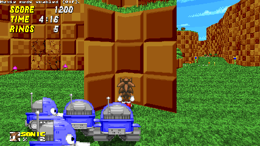

# Balloon mode (A concept for now...)

Just a Lua script that adds a functionality to SRB2 that creates a balloon in your place for helping you to reach higher places.

---

## But what it can do for you?

* *It can save **you** from enemies attacks.*

* *It can wait to you when you die on a netgame, if you **want** obviously.*

* *It can help you reach **secret** places.*

* *It can tell you whether you have **inverse** gravity.*

* *It can't save you if you need **air** underwater.*

* *It can't save you if you got a **irreversible** hurt.*

*This and much more **soon.***

---

## **To do:**

* Add key customization (right now is q)
* Maybe balloon color selection idk...

---

## **Links**

Release Thread: [not yet]

---
\
[benjamin](https://github.com/benjaminfretez)
